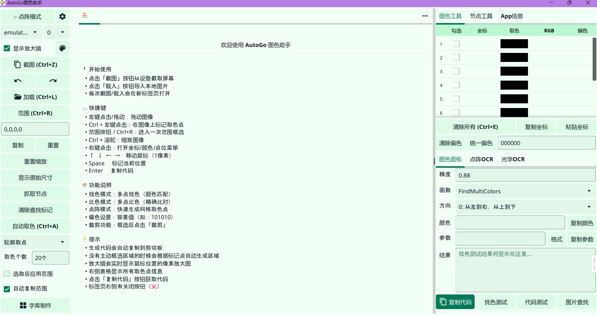
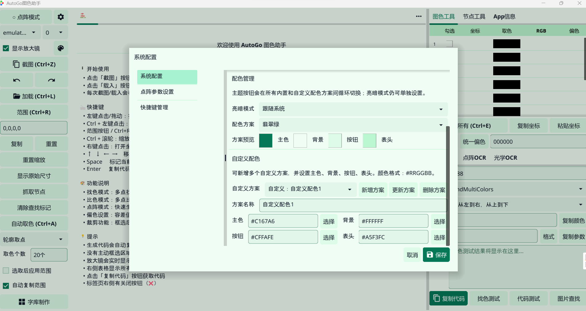
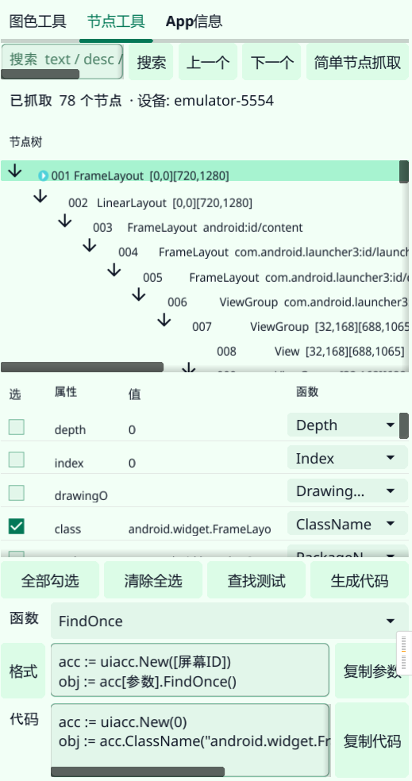

# AutoGo 图色助手

一个基于 Fyne 的 AutoGo 图色辅助工具，用于从 Android 设备通过adb连接进行截图或从本地图片中取色、生成图色相关代码，并辅助查看 Android 节点与应用信息。

> 说明：此代码是基于用户 https://github.com/Dasongzi1366 在群里发布的源码进行开发和维护、 页面布局参考了 懒人精灵的抓抓工具 页面布局。
> 欢迎提issue，等待大佬提pr

## 功能

- 图片处理：Android 设备截图、虚拟屏截图、本地图片拖入、本地图片载入、保存、旋转、裁剪、缩放查看(ctrl+滚轮)。
- 图色取点：手动取色、范围框选、点阵模式、自动取色（随机、轮廓、高亮、高饱和、颜色分类）。
- 代码辅助：生成并复制 AutoGo 图色代码，支持找色测试、代码测试和生成参数格式配置。
- 节点工具：抓取 Android UI 节点，搜索节点，勾选属性并生成 / 复制 `uiacc` 代码。
- App 信息：查询已安装应用，复制应用名称、包名、启动界面和其它界面名称。
- 字库制作：从选区切割字符，添加到字库，支持导入、导出和复制字库内容。
- 配置：自定义快捷键（非常自由）、点阵参数、日志开关、内置/自定义配色方案。
- 双击选点可以选中对应的选点参数， 点击对应的参数列表可以闪烁对应的选点。
- 节点选中后如果不移动继续点击鼠标默认选中它的父节点

## 缺陷
- 目前只测试了windows系统,其他系统未测试
- IOS设备暂不支持截图（有设备的可以自行测试实现）

## 截图

- 主界面



- 颜色配置页面



- 节点工具布局展示




## 运行

```bash
go run .
```

涉及设备截图、节点抓取和 App 信息查询的功能需要本机可用 `adb`，并已连接 Android 设备。

## 编译

### 本地普通构建

普通构建不启用 `opencv_cgo`，不需要本机 OpenCV 环境，适合日常开发和快速验证。OpenCV 真实找图后端不会被编入。

Windows（带图标，启动不弹命令行窗口）：

```powershell
# 首次编译前安装资源生成工具
go install github.com/akavel/rsrc@latest

# 生成 Windows 图标/manifest 资源
rsrc -ico build/logo.ico -manifest windows_icon.manifest -arch amd64 -o rsrc_windows_amd64.syso

# 编译 GUI 子系统版本：-H windowsgui 用于隐藏命令行窗口
go build -ldflags="-s -w -H windowsgui" -o "build/AutoGo图色助手.exe" .

# 清理临时资源文件，图标已嵌入 exe
Remove-Item rsrc_windows_amd64.syso
```

macOS / Linux：

```bash
mkdir -p build
go build -ldflags="-s -w" -o "build/AutoGo图色助手" .
```

### 本地 OpenCV 单文件构建

OpenCV 单文件构建会启用 `opencv_cgo`，并最小静态编译 OpenCV `4.13.0`。首次执行会下载并编译 OpenCV，耗时较长；后续会复用默认工作目录缓存。生成的 Windows exe / macOS 可执行文件不需要额外放置 OpenCV DLL 或 dylib。

Windows amd64：

```powershell
# 需要 MSYS2 UCRT64 MinGW 工具链，确保 gcc/g++/mingw32-make 可用
$env:PATH = "C:\msys64\ucrt64\bin;$env:PATH"

powershell -ExecutionPolicy Bypass `
  -File ".\scripts\build_with_static_opencv_windows.ps1" `
  -Output "build\AutoGo图色助手-opencv.exe" `
  -BuildOpenCVIfMissing
```

macOS arm64 / amd64：

```bash
# 需要 Xcode Command Line Tools 和 cmake；如缺少 cmake 可先执行：brew install cmake
bash scripts/build_with_static_opencv_macos.sh \
  --output "build/AutoGo图色助手-opencv" \
  --arch "$(go env GOARCH)" \
  --build-opencv-if-missing \
  --ldflags "-s -w"
```

如需指定 macOS 架构，将 `--arch` 改为 `arm64` 或 `amd64`。

## 测试

```bash
go test ./...
```

## 备注

- 界面中显示为“待实现”的功能后续随缘更新。

- 本项目纯AI在原项目上进行编写代码，如有bug可让AI帮你修改
